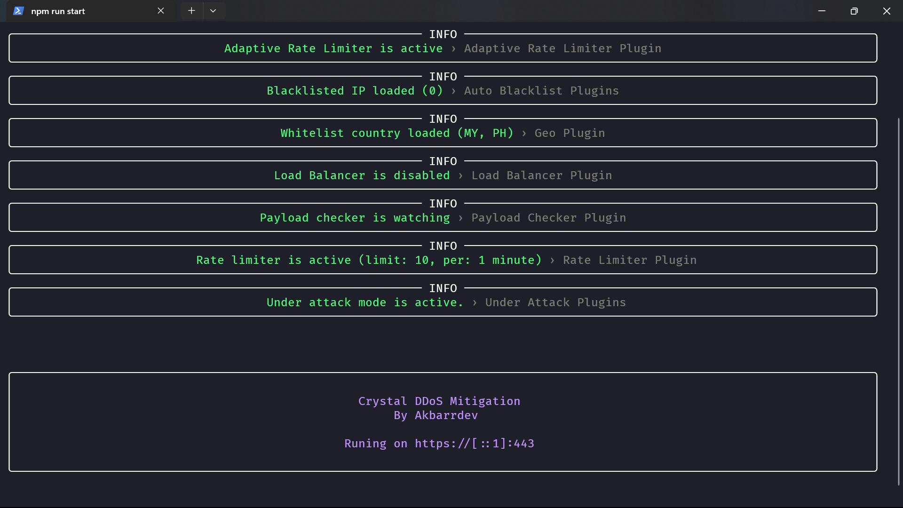
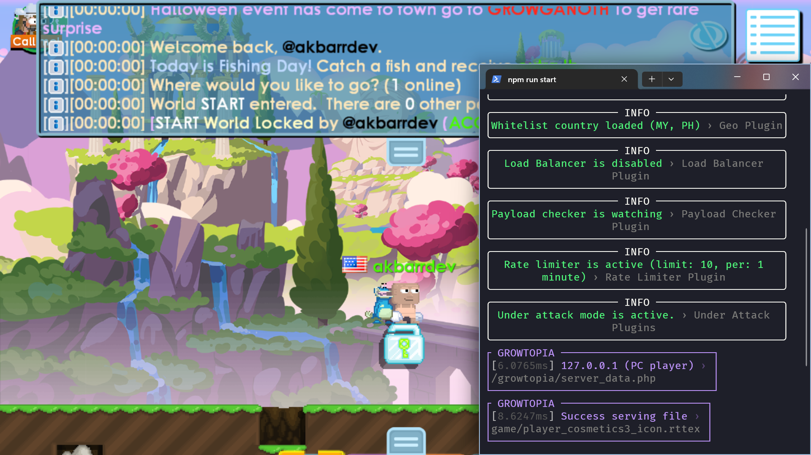
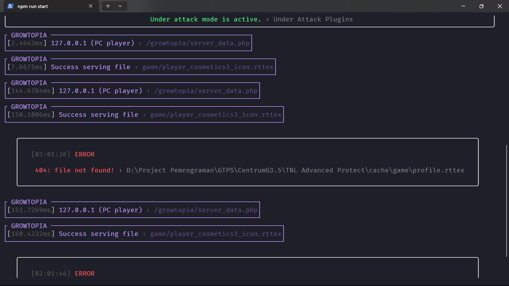
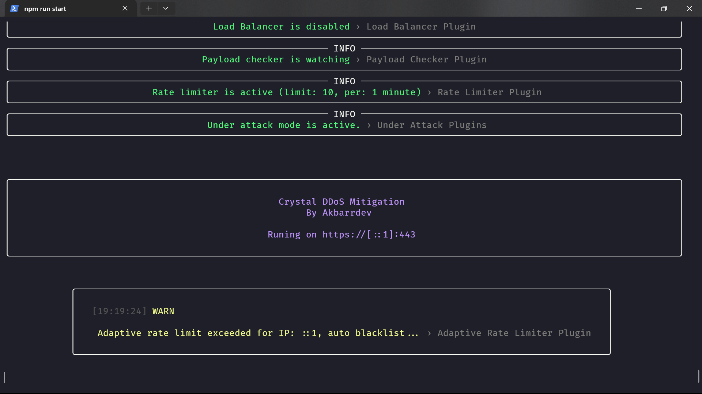
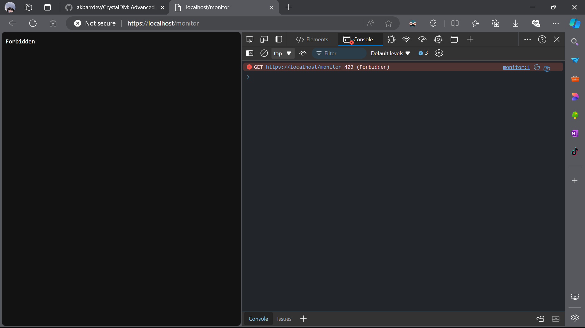
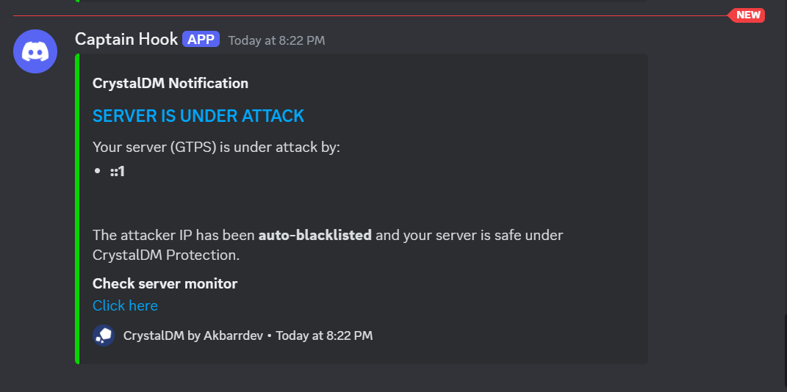

# CrystalDM Features

CrystalDM is an advanced DDoS Mitigation System specifically designed for Growtopia Private Servers (GTPS). This document provides a comprehensive overview of its features and functionalities.

## Table of Contents

1. [Core Features](#core-features)
2. [Security Modules](#security-modules)
3. [Monitoring and Logging](#monitoring-and-logging)
4. [Integration](#integration)
5. [Performance](#performance)
6. [Feature Showcase](#feature-showcase)

## Core Features

### 1. Real-time Protection
CrystalDM provides instant protection against DDoS attacks, ensuring your GTPS remains operational under heavy traffic.

### 2. High Performance
Optimized for minimal impact on server resources, allowing your GTPS to run smoothly even with protection active.

### 3. Easy Configuration
Simple JSON-based configuration file for easy setup and customization.

## Security Modules

### 1. Client Management
- Tracks and manages client connections
- Implements connection limits per IP

### 2. HTTPS Redirect
- Automatically redirects HTTP traffic to HTTPS
- Enhances overall security of the server

### 3. Geo Ban
- Allows blocking or allowing traffic based on geographical location
- Customizable country whitelist and blacklist

### 4. Auto Blacklist
- Automatically blacklists IPs that show malicious behavior
- Configurable thresholds for blacklisting

### 5. Rate Limiter
- Limits the number of requests from a single IP within a specified time frame
- Prevents abuse and brute force attacks

### 6. Web Application Firewall (WAF)
- Inspects incoming traffic for common web attack patterns
- Blocks malicious requests before they reach the server

### 7. IP Reputation Check
- Checks incoming IP addresses against known malicious IP databases
- Blocks traffic from IPs with poor reputation scores

### 8. Adaptive Rate Limiter
- Dynamically adjusts rate limits based on server load and traffic patterns
- Provides more flexible protection during varying traffic conditions

### 9. Under Attack Mode
- Activates stricter security measures during detected attack periods
- Includes challenge-response tests for clients to prove legitimacy

## Monitoring and Logging

### 1. Real-time Server Monitoring
- Provides a web interface for monitoring server performance
- Displays CPU usage, memory usage, network traffic, and more

### 2. Comprehensive Logging
- Detailed logs of all security events and server activities
- Helps in post-attack analysis and system optimization

### 3. Error Handling
- Robust error catching and logging mechanism
- Provides detailed information for troubleshooting

## Integration

### 1. Discord Webhook Integration
- Sends real-time alerts to a Discord channel
- Notifies server admins about attacks and important events

### 2. GTPS Cache Serving
- Efficiently serves GTPS cache files
- Optimizes game data delivery to clients

## Performance

### 1. Load Balancing
- Distributes incoming traffic across multiple server instances
- Improves overall system performance and reliability

### 2. Caching
- Implements intelligent caching mechanisms
- Reduces server load and improves response times

## Feature Showcase

### Main Program Interface

*The main interface of CrystalDM, showing real-time server statistics and security status.*

### GTPS Cache File Serving

*CrystalDM efficiently serving GTPS cache files to clients, ensuring smooth gameplay.*

### Detailed 404 Error Logging

*Comprehensive logging of 404 errors, providing valuable information for debugging and optimization.*

### Auto-Blacklisting DDoS Attacker

*CrystalDM automatically detecting and blacklisting an IP address involved in a DDoS attack.*

### Blacklisted IP Attempt

*The response when a blacklisted IP attempts to access the web interface.*

### Discord Webhook Alert

*An automatic alert sent to Discord, notifying admins of an ongoing attack.*

These features work in concert to provide a robust, efficient, and user-friendly DDoS mitigation solution for GTPS. CrystalDM's modular design allows for easy updates and additions of new features in the future.

## Community

Join our community to get support, share experiences, and stay updated on the latest developments:

Stay connected with the CrystalDM community and get real-time updates, support, and engage with other users!